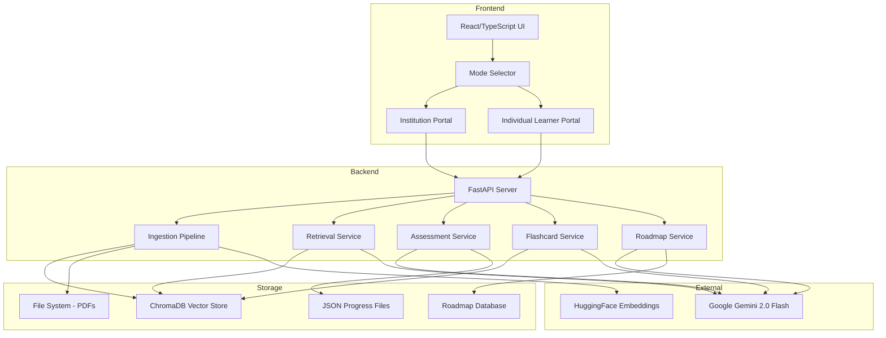

# Design Document

## Overview

C.O.T.E.ai is an AI-powered educational platform with two distinct learning modes: Institution Section (classroom-based learning) and Individual Learner Section (self-directed personalized learning). The system uses RAG (Retrieval-Augmented Generation) with ChromaDB for semantic search, Google Gemini 2.0 Flash for AI generation, and a gamified assessment system based on Bloom's Taxonomy. The architecture follows a FastAPI backend with React/TypeScript frontend, emphasizing modularity and separation of concerns.

## Architecture

### High-Level Architecture



### System Layers

1. **Presentation Layer**: React/TypeScript frontend with Tailwind CSS, handling UI rendering and user interactions
2. **API Layer**: FastAPI REST endpoints for all operations (upload, query, assessment, roadmap)
3. **Service Layer**: Business logic services (ingestion, retrieval, assessment, flashcard, roadmap generation)
4. **Data Layer**: ChromaDB for vector storage, file system for PDFs, JSON files for progress/roadmap data
5. **AI Layer**: Google Gemini 2.0 Flash for generation, HuggingFace for embeddings

## Components and Interfaces

### 1. Mode Selector Component

**Purpose**: Entry point allowing users to choose between Institution and Individual Learner modes.

**Interface**:
```typescript
interface ModeSelector {
  onSelectMode(mode: 'institution' | 'individual'): void;
  persistSelection(mode: string): void;
  loadSavedMode(): string | null;
}
```

**Behavior**:
- Displays two prominent cards/buttons for mode selection
- Persists selection to localStorage
- Redirects to appropriate portal based on selection
- Provides mode switching capability from within the app

### 2. Ingestion Pipeline Service

**Purpose**: Processes PDF documents, extracts text, chunks content, generates embeddings, and stores in vector database.

**Interface**:
```python
class IngestionPipeline:
    def ingest_directory(session_dir: str) -> None:
        """Process all PDFs in directory and store in ChromaDB"""
        
    def extract_text_from_pdf(pdf_path: str) -> str:
        """Extract text using unstructured library"""
        
    def chunk_text(text: str, chunk_size: int = 1000, overlap: int = 200) -> List[str]:
        """Split text into overlapping chunks"""
        
    def generate_embeddings(chunks: List[str]) -> List[List[float]]:
        """Generate embeddings using HuggingFace"""
        
    def store_in_vectordb(chunks: List[str], embeddings: List, metadata: dict) -> None:
        """Store chunks and embeddings in ChromaDB"""
```

**Implementation Details**:
- Uses `unstructured` library with "fast" strategy for PDF parsing
- Chunks text with 1000 character size and 200 character overlap for context preservation
- Uses `sentence-transformers/all-MiniLM-L6-v2` for embeddings (384 dimensions)
- Stores metadata: session_id, filename, chunk_index, timestamp
- Runs as background task to avoid blocking upload response

### 3. RAG-Based Doubt Assistant Service

**Purpose**: Answers student questions using semantic search over uploaded materials with AI-generated responses.

**Interface**:
```python
class RetrievalService:
    def get_doubt_assistant_response(query: str, session_id: str, language: str) -> str:
        """Generate AI response to student query"""
        
    def retrieve_relevant_chunks(query: str, session_id: str, k: int = 8) -> List[Document]:
        """Retrieve relevant document chunks using MMR"""
        
    def format_context(chunks: List[Document]) -> str:
        """Format retrieved chunks for AI prompt"""
        
    def generate_response(query: str, context: str, language: str, teacher_guidance: dict) -> str:
        """Generate response using Gemini with system prompt"""
```

**Implementation Details**:
- Uses Maximum Marginal Relevance (MMR) search with k=8, fetch_k=20, lambda_mult=0.5
- System prompt enforces: formal definition first, then intuitive explanation with analogies
- Includes higher-order thinking prompts (application scenarios, brain teasers)
- Supports multilingual responses (English, Hindi, Telugu, Hinglish)
- Technical terms remain in English, explanations in native script
- Incorporates teacher guidance from review documents when available
- Temperature set to 0.2 for creative analogies while staying grounded
- Implements exponential backoff retry logic for API rate limits

### 4. Assessment System Service

**Purpose**: Generates and evaluates Bloom's Taxonomy-based assessments with three difficulty levels.

**Interface**:
```python
class AssessmentService:
    def generate_assessment(session_id: str, level: int) -> dict:
        """Generate or retrieve cached assessment for level"""
        
    def get_assessment_prompt(level: int, context: str) -> str:
        """Create level-specific prompt for AI generation"""
        
    def submit_assessment_result(session_id: str, level: int, score: int, 
                                 max_score: int, mistakes: List[dict]) -> dict:
        """Process submission, calculate XP, update progress"""
        
    def generate_remedial_plan(mistakes: List[dict]) -> dict:
        """Generate diagnostic remedial plan for failed assessments"""
        
    def get_current_chapter_context(session_id: str, chapter_file: dict) -> str:
        """Extract text from specific chapter PDF"""
```

**Assessment Level Specifications**:

**Level 1 (Recall & Understanding)**:
- 10 Multiple Choice Questions
- Focus: Definitions, direct facts, basic understanding
- Passing threshold: 8/10 correct
- XP reward: 50-100 (random)
- Timer: 10 minutes

**Level 2 (Application & Analysis)**:
- 10 Multiple Choice Questions
- Focus: Scenarios, case studies, application of concepts
- Question format: "A student observes that...", "If X happens..."
- Passing threshold: 7/10 correct
- XP reward: 100-150 (random)
- Timer: 10 minutes

**Level 3 (Creation & Evaluation)**:
- 5 Short Answer Questions
- Focus: "Create a solution", "Critique this method", "Propose an alternative"
- Open-ended requiring synthesis
- Passing threshold: >0 correct
- XP reward: 150-200 + 500 chapter completion bonus
- Timer: 10 minutes
- Upon passing: Advance to next chapter, reset to Level 1

**Caching Strategy**:
- Assessments cached as `{session_id}_lvl{level}.json`
- Cache checked before generation to avoid redundant API calls
- Cache invalidated when chapter changes

**Remedial Plan Generation**:
- Triggered on assessment failure
- Classifies gap: Concept Gap, Application Gap, or Overgeneralization
- Provides guided explanation (<100 words)
- Includes one practice question to verify understanding
- Imposes 10-minute cooldown before retry

### 5. XP and Gamification System

**Purpose**: Motivates learners through experience points, unlocks, and progression tracking.

**Interface**:
```python
class XPSystem:
    def award_xp(session_id: str, amount: int) -> int:
        """Award XP and return new total"""
        
    def spend_xp(session_id: str, amount: int) -> bool:
        """Deduct XP if sufficient balance, return success"""
        
    def get_xp_balance(session_id: str) -> int:
        """Get current XP total"""
        
    def unlock_level(session_id: str, level: int) -> None:
        """Unlock next difficulty level"""
```

**XP Award Structure**:
- Level 1 pass: 50-100 XP (randomized for variability)
- Level 2 pass: 100-150 XP
- Level 3 pass: 150-200 XP + 500 bonus
- Flashcard viewing: +10 XP per session
- Immediate XP notification on assessment completion

**XP Spending**:
- Hints during assessments: Variable cost
- Validation: Prevent spending if insufficient balance
- Deduction tracked in progress file

### 6. Mistakes Repository Service

**Purpose**: Tracks incorrect answers, provides AI explanations, and enables self-reflection.

**Interface**:
```python
class MistakesRepository:
    def store_mistake(session_id: str, mistake: dict) -> None:
        """Store mistake with question, correct answer, user answer"""
        
    def get_mistakes(session_id: str) -> List[dict]:
        """Retrieve all mistakes for session or 'all' for global view"""
        
    def update_mistake_comment(session_id: str, question: str, comment: str) -> bool:
        """Add/update personal comment on mistake"""
        
    def generate_explanation(mistake: dict) -> str:
        """Generate AI explanation for mistake"""
```

**Mistake Data Structure**:
```python
{
    "question": str,
    "correct_answer": str,
    "user_answer": str,
    "explanation": str,  # AI-generated
    "level": int,
    "comments": str,  # User's personal notes
    "timestamp": str,
    "session_id": str  # For global view
}
```

**Features**:
- Automatic deduplication (avoid storing same mistake twice)
- Global mistakes view aggregating across all sessions
- Personal comment system for reflection
- AI-generated explanations for each mistake

### 7. Flashcard Generation Service

**Purpose**: Creates topic-wise revision summaries from uploaded materials.

**Interface**:
```python
class FlashcardService:
    def generate_flashcards(session_id: str, language: str) -> List[dict]:
        """Generate or retrieve cached flashcards"""
        
    def extract_topics(context: str) -> List[str]:
        """Identify distinct core topics from text"""
        
    def generate_summary(topic: str, context: str, language: str) -> str:
        """Generate concise summary for topic"""
```

**Flashcard Specifications**:
- Comprehensive extraction: Identify ALL distinct topics (not limited to fixed number)
- Concise summaries: Max 120 words per topic
- Formatting: Bullet points and bold text for key terms
- Multilingual support: English, Hindi (Devanagari), Telugu (Telugu script), Hinglish (Roman)
- Technical terms: Always in English regardless of language
- Caching: `flashcards_v9_{language}.json` to avoid regeneration

**System Prompt Strategy**:
- Enforces comprehensive topic extraction
- Mandates script compliance (Devanagari for Hindi, Telugu script for Telugu)
- Requires JSON-only output (no markdown formatting)
- Implements retry logic with exponential backoff for rate limits

### 8. Teacher Portal and Analytics Service

**Purpose**: Provides class-wide insights, student progress tracking, and assessment preview.

**Interface**:
```python
class TeacherAnalytics:
    def get_classrooms() -> List[str]:
        """List all available sessions"""
        
    def get_teacher_analytics(session_id: str) -> dict:
        """Generate class-wide analytics"""
        
    def get_all_assessments_for_teacher(session_id: str) -> dict:
        """Retrieve all assessments organized by chapter and level"""
        
    def save_teacher_review(session_id: str, review_data: dict) -> None:
        """Store teacher guidance for AI assistant"""
```

**Analytics Metrics**:
- Total students count
- Level distribution (students at Level 1, 2, 3, completed)
- Stuck percentage (students at lower levels for >3 days)
- Average attempts per level
- Common mistakes with frequency counts

**Teacher Guidance Integration**:
- Teachers upload review documents with assessment focus and student gaps
- Guidance stored as `teacher_review.json` in session directory
- Doubt Assistant incorporates guidance into response generation
- Adjusts explanation style and assessment approach based on teacher input

### 9. Chapter Progression System

**Purpose**: Manages sequential learning through uploaded materials with deadline tracking.

**Interface**:
```python
class ChapterProgression:
    def get_sorted_files(session_id: str) -> List[dict]:
        """Return PDFs sorted by upload timestamp (oldest first)"""
        
    def get_current_chapter(session_id: str) -> dict:
        """Get current chapter file and index"""
        
    def advance_chapter(session_id: str) -> None:
        """Move to next chapter, reset to Level 1"""
        
    def calculate_deadline(chapter_file: dict) -> float:
        """Calculate deadline as upload_time + 5 days"""
        
    def check_lagging_status(session_id: str) -> dict:
        """Determine if student is behind schedule"""
```

**Progression Logic**:
- Chapters ordered by PDF upload timestamp (oldest → newest)
- Students start at chapter 0, level 1
- Level 3 completion triggers chapter advancement
- Deadline: 5 days from chapter upload time
- Lagging status: Current time > deadline
- Warning messages display days late

### 10. Progress Dashboard Service

**Purpose**: Displays comprehensive learning progress and status indicators.

**Interface**:
```python
class ProgressTracker:
    def get_progress(session_id: str) -> dict:
        """Get complete progress data"""
        
    def calculate_weekly_metrics(session_id: str) -> dict:
        """Calculate weekly improvement statistics"""
        
    def get_assessment_history(session_id: str) -> List[dict]:
        """Retrieve past assessment results"""
```

**Progress Data Structure**:
```python
{
    "xp": int,
    "unlocked_level": int,
    "current_chapter_index": int,
    "current_chapter_title": str,
    "next_chapter_title": str,
    "total_chapters": int,
    "status": str,  # "on_track" or "lagging"
    "deadline_message": str,
    "cooldown_remaining": int,  # seconds
    "remedial_plan": dict,  # if failed
    "history": List[dict],
    "mistakes": List[dict]
}
```

## Data Models

### Session Data Model

```python
class Session:
    session_id: str  # Unique identifier
    mode: str  # "institution" or "individual"
    created_at: datetime
    last_accessed: datetime
```

### Institution Progress Model

```python
class InstitutionProgress:
    session_id: str
    xp: int
    unlocked_level: int  # 1, 2, or 3
    current_chapter_index: int
    history: List[AssessmentResult]
    mistakes: List[Mistake]
    retry_available_at: Optional[float]  # Unix timestamp
    remedial_plan: Optional[dict]
```

### Assessment Result Model

```python
class AssessmentResult:
    level: int
    score: int
    max_score: int
    passed: bool
    xp_gained: int
    timestamp: str
```

### Mistake Model

```python
class Mistake:
    question: str
    correct_answer: str
    user_answer: str
    explanation: str
    level: int
    comments: str
    timestamp: str
    session_id: str  # For global view
```

### Roadmap Model

```python
class LearningRoadmap:
    roadmap_id: str  # Unique identifier
    user_id: str  # Individual learner identifier
    title: str  # Auto-generated from goal
    goal: str  # Original goal prompt
    deadline: datetime
    created_at: datetime
    status: str  # "active", "completed", "paused", "abandoned"
    total_days: int
    days_completed: int
    progress_percentage: float
    topics: List[Topic]
    daily_milestones: List[DailyMilestone]
    modification_history: List[dict]
```

### Topic Model

```python
class Topic:
    topic_id: str
    name: str
    description: str
    prerequisites: List[str]  # Topic IDs
    estimated_days: int
    status: str  # "not_started", "in_progress", "completed"
    subtopics: List[Subtopic]
```

### Daily Milestone Model

```python
class DailyMilestone:
    day_number: int
    date: datetime
    topic_id: str
    learning_objectives: List[str]
    resources: List[Resource]
    assessment: DailyAssessment
    completed: bool
    score: Optional[int]
```

### Resource Model

```python
class Resource:
    resource_id: str
    type: str  # "article", "video", "exercise", "reading"
    title: str
    url: Optional[str]
    content: Optional[str]
    estimated_time: int  # minutes
    completed: bool
```

### Daily Assessment Model

```python
class DailyAssessment:
    assessment_id: str
    day_number: int
    questions: List[Question]
    difficulty_mix: dict  # {"recall": 3, "application": 2, "creation": 1}
    completed: bool
    score: Optional[int]
    feedback: Optional[str]
```

### Roadmap Library Model

```python
class RoadmapLibrary:
    user_id: str
    roadmaps: List[RoadmapSummary]
    
class RoadmapSummary:
    roadmap_id: str
    title: str
    goal: str
    deadline: datetime
    progress_percentage: float
    status: str
    created_at: datetime
    last_accessed: datetime
```

## Correctness Properties

*A property is a characteristic or behavior that should hold true across all valid executions of a system—essentially, a formal statement about what the system should do. Properties serve as the bridge between human-readable specifications and machine-verifiable correctness guarantees.*

Before writing the correctness properties, I need to analyze the acceptance criteria for testability.


### Core System Properties

Property 1: File extension validation
*For any* uploaded file, the system should accept it if and only if it has a PDF extension
**Validates: Requirements 1.1**

Property 2: PDF text extraction completeness
*For any* valid PDF file, the extraction process should produce non-empty text content
**Validates: Requirements 1.2**

Property 3: Chunk size constraints
*For any* extracted text, all generated chunks should have size <= 1000 characters (except possibly the last chunk) and overlap of 200 characters between consecutive chunks
**Validates: Requirements 1.3**

Property 4: Embedding generation completeness
*For any* set of text chunks, embeddings should be generated for all chunks with dimension 384 and no null values
**Validates: Requirements 1.4**

Property 5: Ingestion round-trip consistency
*For any* uploaded PDF, after ingestion completes, querying the vector database with content from that PDF should retrieve chunks from that document
**Validates: Requirements 1.5, 1.7**

Property 6: Query retrieval non-emptiness
*For any* query submitted to a session with ingested content, the doubt assistant should return relevant chunks (non-empty result set)
**Validates: Requirements 2.1**

Property 7: Response source grounding
*For any* query with retrieved chunks, the generated response should contain content or references from the source chunks
**Validates: Requirements 2.3**

Property 8: Multilingual support completeness
*For any* language parameter in {English, Hindi, Telugu, Hinglish}, the doubt assistant should generate a response without errors
**Validates: Requirements 2.7**

Property 9: Assessment question count correctness
*For any* generated assessment, Level 1 and Level 2 should contain exactly 10 questions, and Level 3 should contain exactly 5 questions
**Validates: Requirements 3.2, 3.3, 3.4**

Property 10: Assessment caching idempotence
*For any* session and level, generating an assessment twice should return identical results (cached)
**Validates: Requirements 3.6**

Property 11: Level progression on passing
*For any* student passing Level 1 with score >= 8, their unlocked level should be at least 2; passing Level 2 with score >= 7 should unlock level 3
**Validates: Requirements 3.7, 3.8**

Property 12: Chapter advancement on mastery
*For any* student passing Level 3, their chapter index should increment by 1 and unlocked level should reset to 1
**Validates: Requirements 3.9, 8.4**

Property 13: XP award ranges
*For any* assessment pass, Level 1 should award XP in [50, 100], Level 2 in [100, 150], and Level 3 in [650, 700] (including 500 bonus)
**Validates: Requirements 4.1, 4.2, 4.3**

Property 14: XP monotonicity (without spending)
*For any* student completing assessments without spending XP, their total XP should be monotonically increasing
**Validates: Requirements 4.5**

Property 15: XP spending deduction
*For any* XP spend operation, if balance >= amount, the operation should succeed and new balance should equal old balance minus amount
**Validates: Requirements 4.6, 4.7**

Property 16: XP spending prevention on insufficient balance
*For any* XP spend attempt where balance < amount, the operation should fail and balance should remain unchanged
**Validates: Requirements 4.8**

Property 17: Mistake storage completeness
*For any* incorrect answer, a mistake record should be created containing question, correct_answer, user_answer, and explanation fields (all non-empty)
**Validates: Requirements 5.1, 5.2, 13.5**

Property 18: Mistake retrieval completeness
*For any* session, retrieving mistakes should return all previously stored mistakes for that session
**Validates: Requirements 5.3**

Property 19: Mistake comment persistence
*For any* mistake, adding a comment should update the mistake record, and subsequent retrieval should include the comment
**Validates: Requirements 5.4**

Property 20: Remedial plan generation on failure
*For any* failed assessment, a remedial plan should be generated containing diagnosis, explanation, and practice_question fields
**Validates: Requirements 5.5**

Property 21: Remedial plan explanation length constraint
*For any* generated remedial plan, the explanation should be <= 100 words
**Validates: Requirements 5.7**

Property 22: Remedial plan practice question count
*For any* generated remedial plan, it should contain exactly one practice question
**Validates: Requirements 5.8**

Property 23: Cooldown period enforcement
*For any* failed assessment, retry_available_at should be set to current_time + 600 seconds
**Validates: Requirements 5.9**

Property 24: Flashcard topic non-emptiness
*For any* session with ingested content, generated flashcards should contain at least one topic
**Validates: Requirements 6.2**

Property 25: Flashcard summary length constraint
*For any* generated flashcard, the summary should be <= 120 words
**Validates: Requirements 6.3**

Property 26: Flashcard multilingual support
*For any* language parameter in {English, Hindi, Telugu, Hinglish}, flashcards should be generated without errors
**Validates: Requirements 6.5**

Property 27: Flashcard caching idempotence
*For any* session and language, generating flashcards twice should return identical results (cached)
**Validates: Requirements 6.9**

Property 28: Flashcard XP award
*For any* flashcard viewing action, the student's XP should increase
**Validates: Requirements 6.10**

Property 29: Chapter sorting by timestamp
*For any* set of uploaded PDFs in a session, retrieving chapters should return them sorted by upload timestamp (oldest first)
**Validates: Requirements 8.1**

Property 30: Chapter index tracking
*For any* student in a session, their progress data should contain a current_chapter_index field
**Validates: Requirements 8.2**

Property 31: Chapter deadline calculation
*For any* chapter, its deadline should equal upload_timestamp + (5 * 24 * 3600) seconds
**Validates: Requirements 8.6**

Property 32: Lagging status determination
*For any* student where current_time > chapter_deadline, their status should be marked as "lagging"
**Validates: Requirements 8.7**

Property 33: Mode selection persistence
*For any* mode selection, storing the selection then retrieving it should return the same mode value
**Validates: Requirements 10.4**

Property 34: Goal prompt parsing completeness
*For any* submitted goal prompt, the roadmap generator should extract a goal string and timeline (or request clarification if timeline missing)
**Validates: Requirements 11.2, 11.4**

Property 35: Roadmap structure completeness
*For any* generated roadmap, it should contain topics, subtopics, daily_milestones, and learning_objectives fields (all non-empty)
**Validates: Requirements 11.3, 11.6**

Property 36: Daily resource generation on new day
*For any* active roadmap on a new day, daily resources should be generated for that day's milestone
**Validates: Requirements 12.1**

Property 37: Daily resource type diversity
*For any* day's generated resources, there should be at least two different resource types (article, video, exercise, reading)
**Validates: Requirements 12.2**

Property 38: Resource completion status update
*For any* resource, marking it as completed should update its completed field to true
**Validates: Requirements 12.4**

Property 39: Progress update on resource completion
*For any* day where all resources are marked completed, the progress tracker should reflect the completion
**Validates: Requirements 12.5**

Property 40: Historical resource accessibility
*For any* past day in a roadmap, its resources should be retrievable
**Validates: Requirements 12.6**

Property 41: Daily assessment availability after resource completion
*For any* day where all resources are completed, a daily assessment should be available
**Validates: Requirements 13.1**

Property 42: Daily assessment difficulty mix
*For any* daily assessment, it should contain questions of at least two different difficulty levels (recall, application, creation)
**Validates: Requirements 13.2**

Property 43: Assessment feedback immediacy
*For any* submitted assessment, the response should include feedback and score
**Validates: Requirements 13.3**

Property 44: Assessment result persistence
*For any* submitted assessment, the results should be stored and retrievable from progress data
**Validates: Requirements 13.4**

Property 45: Daily score calculation and progress update
*For any* completed daily assessment, a score should be calculated and progress tracker should be updated
**Validates: Requirements 13.6**

Property 46: Adaptive difficulty adjustment
*For any* learner with consistent high performance (e.g., 3+ consecutive high scores), subsequent assessments should increase in difficulty
**Validates: Requirements 13.7**

Property 47: Roadmap deadline modification
*For any* roadmap, modifying the deadline should update the roadmap's deadline field and recalculate daily milestones
**Validates: Requirements 15.1**

Property 48: Progress preservation on roadmap modification
*For any* roadmap modification, all previously completed days should remain marked as completed
**Validates: Requirements 15.2**

Property 49: Topic addition/removal
*For any* roadmap, adding a topic should increase the topics list length by 1, and removing a topic should decrease it by 1
**Validates: Requirements 15.3**

Property 50: Resource update on roadmap modification
*For any* roadmap modification affecting future days, resources for those days should be regenerated
**Validates: Requirements 15.4**

Property 51: Modification history tracking
*For any* roadmap modification, an entry should be added to the modification_history list
**Validates: Requirements 15.5**

Property 52: Unique session identifier generation
*For any* new individual learner, a unique session identifier should be generated that doesn't collide with existing identifiers
**Validates: Requirements 17.1**

Property 53: Roadmap data persistence round-trip
*For any* created roadmap, storing it then retrieving it should return equivalent data (all fields preserved)
**Validates: Requirements 17.2, 17.4**

Property 54: Comprehensive data persistence
*For any* daily resources, assessments, and progress data, storing them then retrieving should return equivalent data
**Validates: Requirements 17.3**

Property 55: Data separation between sections
*For any* data created in Institution Section, it should not appear in Individual Learner Section queries, and vice versa
**Validates: Requirements 17.6**

Property 56: Roadmap library completeness
*For any* individual learner, retrieving their roadmap library should return all roadmaps they have created (past and current)
**Validates: Requirements 18.1**

Property 57: Roadmap loading state restoration
*For any* roadmap in the library, opening it should load its complete state including progress, resources, and assessments
**Validates: Requirements 18.5, 18.6**

Property 58: Multiple active roadmaps support
*For any* individual learner, creating multiple roadmaps should store all of them and make them accessible simultaneously
**Validates: Requirements 18.8**

Property 59: Roadmap status update on pause/archive
*For any* roadmap, pausing it should update status to "paused", and archiving should update status to "abandoned"
**Validates: Requirements 18.9**

Property 60: Roadmap completion status preservation
*For any* roadmap marked as completed, it should remain in the library with status "completed" and be accessible for future reference
**Validates: Requirements 18.10**

## Error Handling

### Input Validation Errors

**Invalid File Upload**:
- Error: Non-PDF file uploaded
- Response: HTTP 400 with message "Only PDF files are allowed"
- Recovery: User re-uploads with valid PDF

**Missing Session ID**:
- Error: API call without session_id parameter
- Response: HTTP 400 with message "session_id is required"
- Recovery: Client includes session_id in request

**Invalid Assessment Level**:
- Error: Request for level outside {1, 2, 3}
- Response: HTTP 400 with message "Level must be 1, 2, or 3"
- Recovery: Client requests valid level

### AI Generation Errors

**Gemini API Rate Limit**:
- Error: 429 Too Many Requests from Gemini API
- Response: Exponential backoff retry (5 attempts, 2-10 second delays)
- Recovery: Automatic retry with backoff, or HTTP 500 if all retries fail

**Gemini API Failure**:
- Error: Non-429 error from Gemini API
- Response: HTTP 500 with message "AI generation failed"
- Recovery: User retries request

**Invalid JSON from AI**:
- Error: AI returns malformed JSON for assessment/flashcard
- Response: Attempt to clean markdown formatting, parse again
- Recovery: If cleaning fails, return HTTP 500 with error message

### Data Access Errors

**Session Not Found**:
- Error: Query for non-existent session
- Response: Return empty results or default values
- Recovery: User uploads materials to create session

**No Documents in Session**:
- Error: Query to session with no ingested documents
- Response: Fallback message "No documents found for this session"
- Recovery: User uploads documents

**ChromaDB Connection Failure**:
- Error: Cannot connect to vector database
- Response: HTTP 500 with message "Database connection failed"
- Recovery: System administrator restarts ChromaDB service

### Progress and State Errors

**Insufficient XP for Spending**:
- Error: Attempt to spend more XP than available
- Response: Return {"success": false, "message": "Insufficient XP"}
- Recovery: User earns more XP before spending

**Cooldown Period Active**:
- Error: Attempt to retry assessment during cooldown
- Response: Return cooldown_remaining seconds
- Recovery: User waits for cooldown to expire

**Invalid Roadmap Modification**:
- Error: Attempt to modify non-existent roadmap
- Response: HTTP 404 with message "Roadmap not found"
- Recovery: User selects valid roadmap from library

### File System Errors

**PDF Parsing Failure**:
- Error: Unstructured library fails to parse PDF
- Response: Log error, skip file, continue with other files
- Recovery: User re-uploads or provides different format

**File Write Failure**:
- Error: Cannot write uploaded file to disk
- Response: HTTP 500 with message "Failed to save file"
- Recovery: User retries upload

**Cache File Corruption**:
- Error: Cached assessment/flashcard file is corrupted
- Response: Delete cache, regenerate from AI
- Recovery: Automatic regeneration

## Testing Strategy

### Dual Testing Approach

The system requires both unit testing and property-based testing for comprehensive coverage:

**Unit Tests**: Verify specific examples, edge cases, and error conditions
- Specific example inputs with known expected outputs
- Edge cases (empty inputs, boundary values, special characters)
- Error conditions (invalid inputs, missing data, API failures)
- Integration points between components

**Property Tests**: Verify universal properties across all inputs
- Universal properties that hold for all valid inputs
- Comprehensive input coverage through randomization
- Minimum 100 iterations per property test (due to randomization)
- Each property test references its design document property

**Balance**: Avoid writing too many unit tests. Property-based tests handle covering lots of inputs. Unit tests should focus on specific examples and integration points.

### Property-Based Testing Configuration

**Library Selection**: Use `hypothesis` for Python backend testing

**Test Configuration**:
- Minimum 100 iterations per property test
- Each test tagged with comment: `# Feature: individual-learner-mode, Property {number}: {property_text}`
- Example:
  ```python
  @given(st.text(min_size=1))
  def test_file_extension_validation(filename):
      # Feature: individual-learner-mode, Property 1: File extension validation
      result = is_allowed_file(filename)
      assert result == filename.lower().endswith('.pdf')
  ```

**Property Test Coverage**:
- All 60 correctness properties must be implemented as property-based tests
- Each property maps to one or more test functions
- Tests use Hypothesis strategies to generate random inputs

### Unit Testing Strategy

**Focus Areas**:
1. **Specific Examples**: Known input-output pairs for key functions
2. **Edge Cases**: Empty strings, null values, boundary conditions
3. **Error Conditions**: Invalid inputs, missing data, API failures
4. **Integration**: Component interactions, API endpoint responses

**Example Unit Tests**:
```python
def test_upload_empty_file_list():
    """Test uploading with no files"""
    response = client.post("/upload", files=[])
    assert response.status_code == 400

def test_doubt_assistant_no_documents():
    """Test query to session with no documents"""
    response = get_doubt_assistant_response("test query", "empty_session")
    assert "couldn't find any information" in response.lower()

def test_xp_spending_insufficient_balance():
    """Test spending more XP than available"""
    result = spend_xp("test_session", 1000)
    assert result == False
```

### Integration Testing

**API Endpoint Tests**:
- Test all FastAPI endpoints with various inputs
- Verify response status codes and data structures
- Test authentication and session management
- Test file upload and background task execution

**End-to-End Flows**:
- Complete assessment flow: generate → submit → evaluate → award XP
- Complete ingestion flow: upload → extract → chunk → embed → store → query
- Complete roadmap flow: create → generate resources → complete day → assess → progress

### Frontend Testing

**Component Tests**:
- Mode selector navigation
- Dashboard rendering with various data states
- Assessment UI with timer and question display
- Roadmap library with multiple roadmaps

**Integration Tests**:
- API communication and error handling
- State management across components
- Navigation between sections

### Performance Testing

**Load Testing**:
- Concurrent uploads from multiple sessions
- Simultaneous queries to doubt assistant
- Multiple assessment generations

**Response Time Targets**:
- Upload endpoint: < 500ms (background processing)
- Doubt assistant query: < 3 seconds
- Assessment generation: < 5 seconds (with caching: < 100ms)
- Flashcard generation: < 5 seconds (with caching: < 100ms)

### Test Data Management

**Fixtures**:
- Sample PDF files with known content
- Pre-generated embeddings for testing
- Mock Gemini API responses
- Sample progress data structures

**Test Isolation**:
- Each test uses unique session IDs
- Cleanup after tests (delete test files, clear test data)
- Mock external dependencies (Gemini API, ChromaDB) where appropriate
